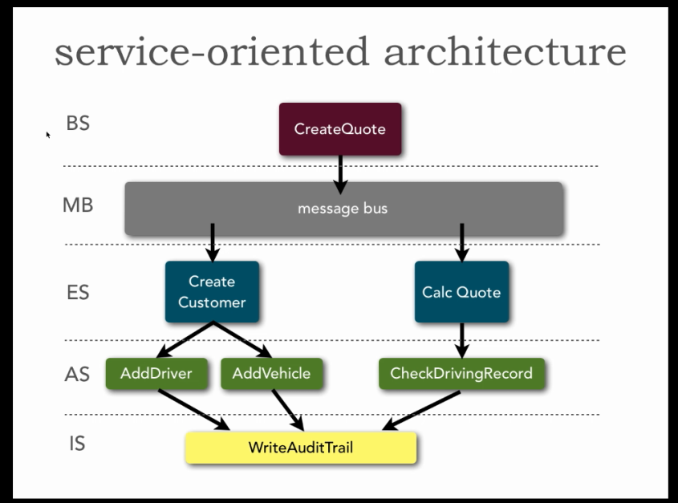

I've been working through the _Software Architecture Fundamentals_ course. These are my notes. They will probably make no sense unless you've taken the course.

This post is a WIP, which I'll update from time to time.

The videos are available from O'Reilly:

- [part 1](http://shop.oreilly.com/product/110000195.do)
- [part 2](http://shop.oreilly.com/product/110000197.do)
- [part 3](http://shop.oreilly.com/product/0636920039464.do)
- [part 4](http://shop.oreilly.com/product/0636920040309.do)

# Part 1

## Video 1: Introduction

- One definition of "architect" is: someone who's seen enough bad projects to know them when they see them.
- Experience of many architectures. I.e., seen a wide variety of projects, in different technologies.
- Architects have seen problems:
    - Politics and negotiation skills can be more valuable than technical skills.
    - Data is often the most important thing. Services and technical approaches subservient to the data.
    - Budget constraints make _feasible_ architecture win out over _best_ architecture.
- "The goal of any engineering design project is the production of some documentation" (from Jack W. Reeves, 1992, [What Is Software Design?](http://www.developerdotstar.com/mag/articles/reeves_design_main.html)). If you're a civil engineer asked to build a bridge, the bridge is not your deliverable. Some other group will build that, but you need to deliver the plan for the bridge for that particular situation (location, purpose).  For software engineering, the plan is the complete source code. Software is cheap to build, incredibly expensive to design.
- General recurring ideas in application, integration, and enterprise architecture:
    - "architect for change": doesn't mean build very generic solutions; means make change less expensive.
    - "software always becomes iterative": agile just does it sooner.
    - "no one architecture/approach can solve every problem": understand why things work, not mechanisms.
    - "separate goals from approaches": understand what your goals are (use hypothesis, metrics), then use approaches to get to the goals.
    - "architecture isn't an equation to be solved; its a snapshot of a process": always changing; there is no perfect unchanging architecture.
    - "architecture is coupled to process": soft skills and other non-technical skills can be very important.

## Video 2: Architecture Soft Skills Part 1

- Architecture is ill defined role, no clear career path, often just the most senior person around.
- Architectural decisions:
  - Is the decision to use Lift/Play/JSF/EJB/Spring/etc an architectural decision? NO
  - Is the decision to use a web-based client an architectural decision? YES
  - (An architect might happen to make the technology choice, but the technology choice should not drive the architecture.)
  - Anti-pattern: selecting technology, then trying to make them work for a problem.
- Expectations of what an architect should do:
    - Analyze technology, industry, trends, and keep current with the trends.
    - Analyze current technology environment, and recommend solutions for improvement. This is the core thing an architect does. Not just performance, reliability, etc, but also around delivery (why is the spring late? why can't we deploy faster?)
    - Ensure compliance with the architecture.
    - Have exposure to multiple and diverse technologies, platforms, and environments. E.g., if you only know JavaEE, you'll going to architect JavaEE.
    - Have exceptional interpersonal skills (teamwork, leadership, negotiation).
    - Define the architecture and design principles. The idea is to guide the technology decisions.
    - Understand the political climate of the business, and navigate the politics. Getting buy-in to decisions is important. Compromise when needed. "Never ask a question you don't know what the answer will be".
 - Four key aspects of an architect, needed to be truly effective:
     1. leadership and communication
     2. technical knowledge
     3. business domain knowledge
     4. methodology and strategy
- Good sources of information:
    - [97 Things Every Software Architect Should Know](http://97things.oreilly.com/wiki/index.  php/97_Things_Every_Software_Architect_Should_Know_-_The_Book)
    - [A Practical Guide to Enterprise Architecture](http://www.amazon.co.uk/Practical-Guide-E  nterprise-Architecture-  Series/dp/0131412752) - really good snippets; focuses a lot on the soft skills
    - [Software Architecture in Practice](http://www.amazon.co.uk/Software-Architecture-Practice-SEI-Engineering/dp/0321815734/) - some good aspects of soft skills

## Video 3: Continuous Delivery

- Nothing new in the first 25+ minutes: history of CI, CI tools, automate the hard things, do them often.
- Cycle time is business differentiator: with a 6 week delivery, you need to get it right; competitor with 2 hour delivery time can afford to experiment.
- "Chicken counting" for number of servers to put in a test environment: 1 prod => 1 in test; n prod => 2 in test.

## Video 4: Architecture Soft Skills Part 2

Looking in detail at the four aspects from "Soft Skills Part 1" (video 2):


- 1 Leadership and Communication:
  - Communication to stakeholders (a stakeholder is anyone with vested interest):
    - Must be effective (not 100 page Word documents, use whiteboards)
    - Explaining complex things to the business is never outsourced. Vital role, valued by business.
  - Collaboration with stakeholders:
    - You'll need to solicit ideas, not wait for stakeholders to discuss architecture with you. That won't happen.
    - Do it early and often; not when it's "done".
  - Clarity in communication:
    - ...focus on the key points
    - ...as appropriate to each stakeholder (business value for some; tech items for others)
  - Translation skills:
    - interpret requirements -> items that impact architecture.
    - "Our biz is constantly changing to meet customer needs" -> extensible, maintainable, agile.
    - "Due to regulation change, it's imperative we complete end of day processing in time" -> performance, scalability.
    - "We need faster time to market" -> agility, maintainability.
    - "We plan to engage in mergers and acquisitions" -> open, agility, maintainable, scalability, integration.
    - "We have a tight time-frame and budget" -> feasibility (maybe RoR is perfect for quick turn around, but we have 100s of JavaEE devs so therefore RoR maybe not feasible)
    - Look beyond the request, and find out what the real requirement is. Ask the _why_ questions. This can have large impact on feasibility.


- 2 Technical Knowledge
  - Three kinds of knowledge: stuff you know (technical depth, tiny, and you need to maintain it); stuff you are aware of (larger, combined with depth is your technical breadth); and stuff you don't know you don't know (largest). Try to increase the top two. _Breadth_ is the most important for an architect. Focus there, and on moving the the unknown into the stuff you are aware of
  - Multi-platform (JavaEE, .Net, LAMP....) knowledge is important part of your technical breadth.
  - Attend conferences, read, scan articles, just spend a few minutes searching and learn about new ideas. This increases technical breadth.


- 3 Business Domain Knowledge
  - Critical to understand the jargon, the industry, goals, trends. So you can understand the architecture impact.
  - Important for communication, and your credibility as an architect.


- 4 Methodology and Strategy
  - Once you know where to go, how do you get there? Agile, lean, feature-driven development, waterfall, scrum.... Understand them and know when they are and are not appropriate.
  - Hybrids: mix parts of the methodologies to use on a project. To do this you need to understand why a particular methodology works.
  - As an architect, it's your job to make it work.

## Video 5: Understanding Large Codebases

- One of the biggest transitions from a developer: shifting from being good at specific problem solving, to understanding code with boxes and lines.
- Run metrics early: to find code smells, but also for training to help junior developers at what is and isn't going to work. Running it at the end just tells you "you're screwed" (or not).
- Metrics
  - Cyclomatic complexity: a number representing the complexity of a function. Allows you to focus on complex parts of a code base.
  - C&K Metrics: For OO code-bases, a collection of metrics: Chidamber & Kemerer (1994) [A Metrics Suite for Object Oriented Design](http://www.pitt.edu/~ckemerer/CK%20research%20papers/MetricForOOD_ChidamberKemerer94.pdf)
    - Easy and trivial ones, not particularly revealing unless pathological: Depth of Inheritance Tree (DIT), Number of Children (NOC), Number of Public Methods (NPM).
    - Quite useful: Weighted methods/class (WMC - sum of cyclomatric complexity, at class level); Response for Class (RCC, number of methods executed due to method call); Lack of Cohesion (LCOM, e.g., a class with an A field and B filed, and methods that only work on A or B, that would have a high LCOM score); efferent and afferent coupling (CE and CA, sum of other classes this class uses (outgoing), or other classes use this class (incoming calls).
 - But...
   - features of some languages (like getters/setters in Java) can skew some of the metrics.
   - watch out for noise.
   - here's no 1 True Metric.
   - often gathered, and then ignored. Too late when you look at them again.
   - inaction or overaction ([Hawthorn effect](http://en.wikipedia.org/wiki/Hawthorne_effect)), developers will start gaming the metrics.
    - prefer trends to specific values. You might have "high" complexity because you have a complex domain, but if it's tending x2, that's probably worth looking at.
- Looking at metric is a analysis burden: visualize that shit.
    - [Source Monitor](http://www.campwoodsw.com/sourcemonitor.html) - produces [Kiviat graphs](http://en.wikipedia.org/wiki/Radar_chart), showing position of a value in a defined range.
    - [Panopticode](http://sourceforge.net/projects/panopticode/) - produces heat maps of complete code base, to see hot spots of some metrics.
    - Size and complexity pyramid, compact representation of fixed metrics, colourd by "industry standard" values. Commercial software [inCode](http://www.intooitus.com/products/incode) (€99); open source ancestor is [iPlasma](http://loose.upt.ro/reengineering/research/iplasma). Both for Java.
    - [Toxicity](http://erik.doernenburg.com/2008/11/how-toxic-is-your-code/): aggregating checkstyle rules to give a per-file visualization.
    - Lots of innovation in the Smalltalk community. An example is Code Crawler from [Moose Technology](http://www.moosetechnology.org); ported to Java as [X-Ray](http://xray.inf.usi.ch/xray.php). X-Ray also gives class and package dependency views, to see what is connected to what. Also "proximity alert", which uses coupling to warn you if you're changing a package that you may need to change another package.
    - [Code City](http://www.inf.usi.ch/phd/wettel/codecity.html) lays out code as a city, allowing you to explore regions, add colour based on metrics.
    - [Sonar](http://www.sonarqube.org/), good for showing data over time.

## Video 6: Architecting for Change

- Business is in a constant state of change. Technology is in a constant state of change.
- "Architecture Agility" - the ability to respond quickly to a constantly changing environment.
- Techniques for improving ability to change:
  - 1 Reduce Dependencies
    - Decouple components (e.g., via messaging, or some other mechanism).
    - Means less co-ordination required for a change.
    - Faster to deploy (less has changed).
    - Allows components to evolve independently. E.g., if you need to re-write a component.
    - Trade-offs: performance may reduce if there's an intermediation; may increase complexity.
  - 2 Leverage Standards
    - Industry standards allow us to more easily integrate
    - Corporate standards give us economies of scale (existing developers with particular skills)
    - De-facto standards (e.g., Spring, Hibernate) has a large pool of skill, allowing you to find developers ready to work, allowing you reduce effort in carrying out a change. But, lower developer standards, so put more effort into hiring to get good people.
    - ...these standards may not be first choices.
  - 3 Create Product-Agnostic Architectures
    - Avoid vendor lock-in, but putting an abstractions between your code and a vendor product.
    - "Anti corruption" layer
  - 4 Create Domain-Specific Architectures (or domain-driven architecture)
    - Generic architectures are difficult to change because they are too broad, and may include scenarios that are not used.
    - Reduce scope: based on industry. E.g., financial needs performance.

## Video 7: Architecture Patterns Part 1

- Traditional Layered Architecture:
  - E.g., presentation, business, persistence, and database layers.
  - The point is that each layer is closed: you cannot jump layers. Information flows down from presentation down.
  - Advantages: separation of concerns; and isolation to allow change to a layer without (much or any) impact above.
  - The sink hole anti-pattern is when you have layers and abstractions because you feel you have to.
  - Variations: shared services are "open layers", which allows a layer to jump over a layer. E.g., business layer direct to persistence layer without using a shared service that sits between them.
  - Good general purpose pattern. Good starting point.
  - Easy to implement, test, and govern. Most people know it.
  - You may not get enough performance in some industries.


- Event Driven Architecture:
  - Made up of events and processes.
  - Fire and forget messaging (not request response).
  - Processes are independent (decoupled), and don't care where events come from.
  - 1 Event Processor topology:
    - Centralized event processor listens for events on an event queue.
    - Pushes messages out to event topics.
    - Processors listen on specific event topics and processes them.
  - 2 Broker topology:
    - Central broker (e.g., ActiveMQ) with topics.
    - Processors listen on topics, and push messages back to the broker.
    - Compared to Event Processor, there is no mediator: each process decides what to do with messages.
  - 3 Broker-less topology:
    - Events arrive at a process
    - Each process has to know location/address of other processes to pass on messages.
  - Highly decoupled and distributed (scalable).
  - Great for complex processes, and processes that change. Event driven businesses.
  - But: high degree of complexity. Hard to understand what some business process actually is.


- Service Orientated Architecture:
  - Ideas: Business Services, Enterprise Services, Application Services, Infrastructure Services, Message Bus.
  - Business Services are things like ProcessClaim, MakeTrade. Abstract, no implementation at this level (perhaps BEPL, WSDL)
  - Enterprise Services are course-grained, and may be unique to a Business Service or used by many Business Services. Examples: CreateCustomer, CalculateQuote.
  - Application Services are bound to an application context, and generally not shared. Database updates and queries, validation. Examples: getInventoryCount, addVehcileToQuote.
  - Infrastructure Services: used by Application Services and Enterprise Services. Non-business implementations, such as audit, security, SSO, logging.
  - Message Bus provides:
    - Process Processor choreographer (for Business Services).
    - Service Orchestrator (for Enterprise Services).
    - Service registry.
    - Protocol Transformation (for talking between different service implementation).
    - Message Enhancement and Message Transformation.
  - Good pattern for understanding business processes and services.
  - Good for large, complex, heterogeneous business and common services (insurance), not so good for trading (because it has many, ad hoc,  different services).
  - High complexity, difficult to implement (complex tools, hype, misconceptions, can be hard to find record of authority for data, data consolidation hard and users may strongly defend their data...).




## Video 8: Architecture Patterns Part 2

- Pipeline Architecture (a.k.a. pipes and filters):
  - Pipes: uni-directional, any payload, usually point-to-point, but could be message based for scalability)
  - Filters: self-contained, independent from others, usually for a single specific task.
  - Four types of filter:
    - producer - starting point
    - transformer - processing of some kind, such as converter, reducer,
    - tester - may pass-thru or discard data, a gate, such as validator.
    - consumer - ending point
  - Looks similar to Event Driven Architecture, but in comparison Pipeline is...
    - typically synchronous (not asynchronous), although that is an implementation detail.
    - pipes have single targets (events can have multiple)
    - single-purpose filters (vs. complex multi-purpose processors)
  - Good for systems with smaller system with deterministic flow, while maintaining decoupling to support change, allowing for evolutionary change.
  - Write up at [Enterprise integration Patterns](http://www.eaipatterns.com/PipesAndFilters.html) and [Wikipedia](http://en.wikipedia.org/wiki/Pipeline_%28software%29).


- Microkernel Architecture (a.k.a plug-in architecture):
  - You have a core system (typically small), and add plug-in modules that are independent of others, and contain exceptional paths to the core system with extra rules and logic.
  - Example: insurance claims processing. Complex between each State in the US does something different. Typically rule engines are used to solve these problems, but you could use a plug-in architecture with a module for each state.
  - Might make sense to use this architecture in some parts of a system. Combine architectures where it makes sense.


- Space-based Architecture:
  - Scalability: often hit scalability at the database, which are not designed to scale linearly as web and applications servers are.
  - Space-based architecture solves that problem with:
    - processing units (as many as you like). This is the application, with a data cache, and data replication.
    - virtualized middleware accepts requests and handles them off to a processing unit
      - messaging grid
      - data grid (distributes data across processors, and typically synchronizes to a database record of authority). No single datastore in the line-of-sight of a request.
      - processing grid, for handling processor co-ordination for parallel activities.
      - deployment manager
   - Good for applications with large variable peak usage
   - Not good fit for large transitional RDBMS-based systems
   - Complex and expensive pattern (expensive may be relative to your pain)
   - Good [write up at Wikipedia](http://en.wikipedia.org/wiki/Space-based_architecture).

## Video 9: Design Patterns

- Design Patterns (Strategy, Command, Template, Observer, etc) are closer to the code as the architecture patterns in last two chapters.
- Good: common vocab, design guide, people familiar with them.
- Bad: limiting creativity, not a panacea.
- Compares OOP and Functional (Clojure), as a way of problem solving (the old example of Apache Commons indexOfAny ported to Clojure).
- Skipped thru most of this chapter.

## Video 10: Architecture Anti-Patterns Part 1

- Architecture By Implication:
  - Systems lacking a clear and consistent architecture.
  - This pattern from overconfidence: we know what we're doing, we don't need architecture.
  - Agile not a substitute for creating an architecture.


- Covering Your Assets:
  - Documenting and presenting alternatives _without ever making an architecture decision_.
  - Your job as an architect is to present alternatives, articulate pros and cons, and then recommend the best architecture for the situation.


- Witches Brew:
  - Architecture designed by groups, resulting in a mix of ideas and lack of clear vision.
  - Avoid with:
    - Responsible and knowledgeable architect.
    - Architecture validation and trade off analysts (A-ATAM).
    - Ongoing architecture discussion and peer review.


- Gold Plating:
  - Continuing to define architecture past the point it has any value.
  - Problematic because too many details hide the core principles; leads to analysis paralysis; increase cost; complex and overly-detailed architecture is hard to understand.


- Vendor King:
  - Product-dependent architecture. Leads to loss of control and cost.
  - Vendor lock-in.


- Big Bang Architecture:
  - Design the entire architecture at the beginning of the project, and you know least about the system.
  - Big up-front design.
  - Fix: only architect what you need get get started; evolve the architecture as you learn more.


## Video 11: Architecture Anti-Patterns Part 2

- Armchair Architecture:
  - Whiteboard sketches are handed off as final architecture, without proving out the design.
  - a.k.a. "paper architect" or "ivory tower architect".
  - Occurs when you have a non-coding architect. You can better understand the decisions, and the implications (e.g., to team skills), if you code.
  - Occurs if...
    - architect is not involved in full product life-cycle.
    - consultant architect hands over architecture and leaves: needs longer involvement.
    - architect has no idea what they are doing ("blame the implementers").
  - To avoid make sure you keep current with a coding project, pair programing with the team, or code reviewing.
  - As an architect, be sure to be an integral part of the dev team.


- Playing With New Toys:
  - Incorporating unproven technologies that don't really fit the problem.
  - When incorporating a new technology, ask yourself:
    - purpose: what value is being delivered by the tool? (Or are you CV building?)
    - proven: is it proven for your situation?
    - overlap: is there something we have already supplying the functionality?
    - feasibility: does your team have the skills necessary? (Desire to work on cool stuff vs. the business goals).


- Spider Web Architecture:
  - Creating large number of web services---because you can---that are never used.
  - Problem: creates confusion over what's useful (vs available); maintenance cost.
  - Let the requirements drive what needs to be expose.


- Infinity Architecture:
  - Over-generalized generalized architecture and interfaces.
  - Solves every need, very expensive, hard to change. "We _may_ need..."
  - Instead, reduce scope with domain-specific architecture.
  - Tackle with...
    - Require specific business requirements (we don't need X, we won't include X).
    - Take business goals into account (short QnD project? or major piece of the business?).
    - Business direction (making money? losing money?)
    - Industry tends help validate "we _may_ need..." comments.
  - Generalized interfaces are also a problem. Very broad interfaces provide no contract, so you can only look at the code to determine how systems behave. Expensive.


- Groundhog Day:
  - Critical arch decisions made early, that are lost, forgotten, or never communicated.
  - "Email drive architecture".
  - Symptoms:
    - people forget, or don't know, that decisions are made.  The same decisions keeps being discussed.
    - no-one understands why a decision was made, so question it again and again.
  - Avoid via...
    - capture all decisions (wiki or similar) and make available centrally.
    - right stakeholders need to know about critical decisions and where to find them.


- Stovepipe Architecture:
  - Ad-hoc collection of ideas, concepts, and components that lead to an ugly and brittle architecture.
  - Symptoms:
    - lack of proper abstractions
    - lack of an integrated solution (arbitrary choices made)
    - lack of guidance (armchair architect)
    - a hard to change or maintain architecture

## Video 12: Tooling and Documentation

- As an architect, you get to choice the tooling.
- Everything interconnects: You can't separate process form architecture
- Dietlzer's Law: user's always want 100% of what they want.  A tool that gets you 80% fast, 10% hard, and the last 10% impossible, won't do.
- Example of Maven: opinionated, rigid, generic, dogmatic. What you want at the start of a project, making it easy to get started. As your project develops, you will reach a point where you fight the tool. Don't become locked into a tool at that point. Pick the best tool for the job at whatever point you are in the project. Re-evaluate when friction occurs.


- How do you document architecture?
  - UML? If you want to learn about UML, [UML Distilled](http://martinfowler.com/books/uml.html). Lead to modern driven architecture, lots of vendor tools... but died.
  - UML is too technical for business, not technical enough for development team.


- Documentation problems:
  - To what level of detail? When do you stop?
  - Who is it for? What is the benefit? Judge effort vs. benefit?
  - Needs to be malleable.
  - Always (potentially) out of date (changing code doesn't force you to change documentation), or looks out of date if not touched for some time.


- Javadoc-level of documentation. Don't do it until the end of the project because of refactoring, and evolving design. Automate, using tools like [yDoc](https://www.yworks.com/en/products_ydoc.html) and [SchemaSpy](http://schemaspy.sourceforge.net/).
- Capture in situ design, using cameras, smart whiteboards, iPad hooked to projector + [a note app](https://evernote.com/penultimate/).
- If you have folder of documents, make sure you distinguish "current" from "archeology".  Your job to keep them up to date.  What it is not worth updating, move it to "archeology".


## Video 13: Integration Architecture Fundamentals

- Integration Architecture: heterogeneous systems, and exchanging information between the systems, and communicating with different teams.
- Three types of applications w.r.t. integration architecture:
  - open internal apps: willing and able to expose to any protocol.
  - closed internal apps: not willing to to work with other protocols (e.g., "just talk to the database")
  - closed external app: expose protocols that you have to live with (e.g., government services, vendor services).


- Challenges:
  - To integrate to closed applications, you need to provide a variety of protocols, and support them as the closed applications change.
  - Remote invocations are slower.
  - Remote systems may become unavailable.
  - How do you deal with remote contract changes? (Versioning? Consumer-driven contracts?)
  - Security, authentication, authorization, federation.


- Integration Styles. Four common ones from the [Enterprise Integration Patterns](http://www.enterpriseintegrationpatterns.com/) (EIP) book.
  - 1 File Transfer:
    - A file with some data placed somewhere.
    - Simple, decoupled, universal.
    - Error-prone, slow, timeliness of data, expensive, data-only.
  - 2 Shared Database:
    - Shared data in a single database.
    - Easy, quick, and simple in some organizations, near universal, decoupling via coupling in the schema.
    - But: bottleneck around integration points, ownership (read/write) issues, political, apps become locked to a schema making change hard, ORMs cache data and believe they are the owners of the database but other processes change the data under them making ORMs/caches unusable.
    - You should own [Refactoring Databases](http://databaserefactoring.com/), especially to handle change to this style of integration.
  - 3 Remote Procedure Invocation:
    - Some kind of stub/skeleton protocol to involve a function and return a result. CORBA, RMI, RPC, REST, SOAP...
    - Gives you data encapsulation and ownership, tools.
    - But... tight coupling between systems, dependent on availability, poor asynchronous support.
    - History and summary of remote procedure styles for about 20 minutes.
    - Notes that REST maps well to state machines, as per [REST in Practice](http://shop.oreilly.com/product/9780596805838.do).
  - 4 Messaging:
    - Async reliable messaging, highly decoupled, highly scalable, good tools and implementations, good monitoring
    - But... difficult to integrate externally beyond the firewall, testing and debugging is complex, standards still evolving.

## Video 14: Enterprise Architecture Concepts and Fundamentals

- Business Strategy and Operating Model generates Business Needs
- Business Operations, and IT Systems And infrastructure give IT Capabilities
- Enterprise architecture sites between the two. Contains Enterprise Technical Architecture. Identifies gaps between business goals and IT capabilities.
- Primary goal: facilitate change.
- Resources:
  - [Enterprise Architecture as Strategy](http://www.amazon.co.uk/Enterprise-Architecture-Strategy-Foundation-Execution/dp/1591398398) - talks about building up a platform of execution.
  - [A Practical Guide to Enterprise Architecture](http://www.amazon.co.uk/Practical-Guide-Enterprise-Architecture-Series/dp/0131412752) - pragmatic aspects.
  - [The Real Business of IT](http://www.amazon.co.uk/Real-Business-IT-Communicate-Gartner/dp/1422147614) - written for CIO, about how to communicate the value of IT. The Enterprise Architecture needs to know this, and it is a fun read.


# Part 2

## Video 15: Architecture Tradeoffs

- The story of [Vasa](http://en.wikipedia.org/wiki/Vasa_%28ship%29): the secret of failure is to try to please everybody.
- Architecture Tradeoff Analysis Method (ATAM).
- Example: highly extensible and high performance are hard, if not impossible, to combine as goals. So you need to be able to decide what is most important. That's what ATAM helps with.
- ATAM process
  - Inputs: proposed architecture, business drivers, quality attributes (performance, feasibility, scalability, extensibility, etc).
  - Output: validated and approved architecture.
  - The process is a waterfall approach, and has problems.
- Phases:
  - 1 Partnership and Preparation: introduction and roles, who to invite and not, agenda, explain process, figure out logistics.
  - 2 Evaluation Phase 1: Present (3Cs: communication, clarity) and defend the architecture through scenario challenges from the stakeholders. Explain trade offs.
  - 3 Evaluation Phase 2: prioritize scenarios and drivers. This is a negotiation. Present results. Be firm and objective from an engineering standpoint, not bow to political pressure, because you'll just be storing up problems for later.
  - 4 Followup: Finalize architecture, document, sign off.
- Issues:
  - getting stake holders (CTO, CIO, operations, business owners) together is hard. Typically don't include developers.
  - assumes architecture is complete
  - highly collaborative: hard to do effectively when distributed.
  - assumes one-time process with no change, and all scenarios and requirements are known up front.
- Agile ATAM (A-ATAM).
  - Focus on the goals of ATAM, not the process: create architecture presentation, validate it, establish trade offs, identify and mitigate risk, and get stakeholder (including developer) buy-in.
  - Start with a conceptual architecture, evolve it, rinse, repeat, include new or changing scenarios as you go.
  - Getting everyone together is not practical: meet with smaller groups more frequently. Pick trusted representatives into the meetings, to capture various trade-off combinations.
- Resources
  - [Software Architecture in Practice](http://www.amazon.co.uk/dp/0321815734/) - Formal process in lots of details
  - [ATAM: Method for Architecture Evaluation](http://resources.sei.cmu.edu/library/asset-view.cfm?assetID=5177) paper - Academic formal process

## Video 16: Continuous Delivery Part 1

- ...and process of continuous delivery and the impact on application architecture.
- Defined as [Continuous Delivery: Reliable Software Releases Through Build, Test, and Deployment Automation](http://www.amazon.co.uk/Continuous-Delivery-Deployment-Automation-Addison-Wesley/dp/0321601912).
- CI, but broader. Fast, automated feedback for change to any part of the ecosystem (code, infrastructure, or configuration).
- Remove lags and bottle necks from deployment, such as those added by a "QA phase" leading to a "Release phase". Have a constant flow of features into release.
- Build delivery and deployment into architecture design.
- Look for friction and pain and remove it.
- Automate all the things. Can be simple script, but time-box to avoid going down the rabbit hole. But don't give up.
- Yesterday's best practice is tomorrow's anti-pattern:
  - Re-evaluate the architecture: you may be solving problems, or working with constraints, that have gone away
  - Keep up with trends in architecture.
  - Example: shared resources were important, so we had EJB containers, and layered architecture. But resources are now cheap (e.g., EC2), so we are left with a problem of coupling (big bang releases, upgrades difficult, dependencies...), because we have a shared architecture because of a problem that we don't have anymore.
- Evolutionary Architecture and Emergent Design
  - Architecture always becomes iterative. Agile embraces this.
  - Build vertical slices to deliver business value; fill out more of the architecture over time.
  - Consequences of less time up-front:
    - have to be hands-on to be aware of the code to understand changes that may impact architecture.
    - less likely to be caught by some anti-patterns
  - Engineering Practices:
    - [Trunk based branching](http://paulhammant.com/2013/04/05/what-is-trunk-based-development/)
    - Hide new functionality until it is finished. Integrate everyday, but new features, when complete, show up. E.g., behind a feature switch (or toggle).
       - Toggles: great for UI. Ideally, just make the UI toggles on and off, but enable rest of server code to avoid a mess of toggles.  If you need to toggle in the code, toggle only at highest level.
       - Schedule issue/card/ticket to remove toggle logic.
       - Frameworks: [togglz](http://www.togglz.org/) (JVM platform), includes support for gradual roll-out per user.
    - Make all changes incrementally as a series of small changes each of which is a release.
      - ["Canary release"](http://martinfowler.com/bliki/CanaryRelease.html) - reduce risk by releasing features to only a few users at a time. E.g., to check for performance of a new feature, see what the effect is by monitoring infrastructure.
      - ["Dark launching"](https://www.facebook.com/note.php?note_id=96390263919) - "Essentially a subset of user queries are routed to help us test, by making "silent" queries to the code that, on launch night, will have to absorb the traffic. This exposes pain points and areas of our infrastructure that needs attention prior to the actual launch."
      - [Branch by abstraction](http://www.martinfowler.com/bliki/BranchByAbstraction.html) - make large scale changes to a code base ([strangler pattern](http://paulhammant.com/2013/07/14/legacy-application-strangulation-case-studies/)). I.e., put an abstraction between old and new code, and slowly replace the old with the new.


## Video 17: Applying Abstraction

* Abstraction minimizes change.  As an example, if you abstract communication between components, perhaps by placing a message bus between components, you can change a component location or implementation and the other components don't need to change.
* Cost of abstraction (generally):
  - decreased performance
  - added complexity
  - increased development, testing, maintenance time and effort.
* But: there is no black and white here. Don't say "we can't abstract because we need performance".
* Five Aspects of Abstraction, in increasing difficulty:
  1. location transparency (don't care where the component lives)
  2. name transparency (don't care what the implementation is called)
  3. implementation transparency (don't care what it's written in)
  4. access decoupling (don't care what the transport used by the component)
  5. contract decoupling (don't care what the signature is of the component; it wants strings, but I'm going to give it XML)
* Methods of Abstraction, and how they compare to the five aspects:
  - Messaging
    * Put a messaging channel between components, decoupling access.
    * Does not give access or contract decoupling.
  - Adapter
    * Instead of a message queue, put a adapter in front of a component. An intermediary to take a request, and deliver it to a component.
    * Has the capability to give all five of the abstractions (at full complexity, but an evolve from simpler starting point).
  - Message Bus
    * Talk to a component by sending a message to a bus, and components connect to the bus. The message bus now handles the orchestration.
    * Has all five of the abstractions.
* Abstraction patterns (e.g., event-drive architecture, SOA...) provide ways to achieve abstraction.
* There are cost and complexity trade-offs in the choices.


## Video 18: Choosing and Comparing Architectures

* Track trends, as (a) you'll find people who use them and want to work with them, and (b) they focus on current problems, not previous problems.
* Build your own feature matrix (including negatives, which you won't find in a marketing statement)
* Knowledge acquisition via Spikes. These are time-boxed experimentation, to be thrown away, no requirement for tests or usual engineering practices -- you just want to find out something fast. E.g., to populate a feature matrix. A spike is not a prototype. Throw away spikes; prototypes are expected to grow into products.


* Two architectures outside the mainstream:
  - CQRS (command query responsibility separation)
    * 
    * Simplification for database access.
    * Two data stores: Read-only (queries) and write-only (commands).
    * Background threads syncs commands to the query database.
    * Works well for task-based UI, event-sourcing architectures, complex or granular domains (model directly on the commands and queries).
    * Difficult for transactions ([eventual consistency](http://www.allthingsdistributed.com/2008/12/eventually_consistent.html) is what you get)
    * [Domain logic classification](http://martinfowler.com/bliki/EagerReadDerivation.html):
      - Three classifications: validations, consequences (world-changing actions), derivations (figuring out something based on what we have, such as reporting).
      - Database updates master record store, but async thread updates a reporting database in the format the UI wants. Separate cache for UI.
      - Commonly done on top of CQRS.


  - [LMAX](http://www.martinfowler.com/articles/lmax.html) and [presentation](https://github.com/jamie-allen/sdisruptor/blob/master/presentation/disruptor.pdf)
    * High-throughput architecture (e.g., trading platform)
    * Handles 6m orders/sec on 1 JVM thread. Tried transactions, didn't work. Tried actors, didn't work. They reached an architecture by scientific method, and discovered CPU caching is key to high throughput.
    * 
    * In-memory business logic processor
    * "Disruptors", network of lock-less queues.
    * 
    * 

* Choices
  - It depends
  - Tension between YAGNI (You aren't gonna need it) vs. architecture for change

## Video 19: Web Services and Messaging

* This chapter focuses HATEOAS as an internal service integration, based on  [Rest in Practice](http://my.safaribooksonline.com/book/web-development/web-services/9781449383312) (Webber et al).
* Level 2 REST (i.e., many URIs, many verbs) can be CRUD, which means the client has to drive the workflow. This couples the client and server.
* Hypermedia as the engine of application state aims to improve on this by integrating at the workflow. The server drives the workflow: the responses not only contain data, but also resources to take the client to the next state. This reducing coupling, as the client only needs to know the first step in a process.
* Important features of HATEOAS:
  - Domain Application Protocol (DAP), a combination of URI and verb to drive a state machine.
  - media types
  - `rel` type for semantic markup


* How does this compare to messaging?  Picking between web services and messaging is an architecture decision:
  - asynchronous: messaging is, web services is not.
  - reliable: yes for messaging, not for web services.
  - monitoring: messaging can be tracked through the whole system; weaker for web services.
  - exception processing: stronger for messaging than web services.
  - performance: binary protocol helps messaging do a better job here too.
  - external firewall access: web services have a big advantage here. (Some products can do JSM over REST, but there are mismatches).

Recommendations: messaging inside the firewall; web services for external services (outside the firewall).


## Video 20: SOA Fundamentals

* What is considered SOA? Must have:
  1. business services (e.g., "placing a trade", "shipping a product"); and
  2. service abstraction (could working with any mix of technologies).
* 1 Services:  
  * Business services are owned by the business and are broad. For a car insurance company "generate quote" might be a business service).
  * Application services are owned by developers are are more specific. E.g., "Add a vehicle" to a quote. The company is not in the business of "add vehicle", which is why it is not a business service. Fine grained, narrow scope.
  * Infrastructures services: enterprise-wide scope services. E.g., logging, security.
* 2 Abstraction, needs all of these:
  - location transparency
  - name transparency
  - implementation transparency (language)
  - access decoupling (protocol)
  - contract decoupling


* Implementing SOA:
  - service registry: maps business service, exposed as the set of enterprise services and how to reach them. This gives name, location, and implementation transparency.
  - message enhancement: converting data, e.g., to convert a message containing data used by the business (address) to the data used by a service (lat,lon). This gives contract decoupling.
  - message transformation: changing the format of messages. E.g., XML to a POJO.  Another form of contract decoupling.
  - protocol transformation: so a client can work in one protocol and have it converted to the protocol used by an enterprise service. This gives access decoupling and implementation transparency.

## Video 21: Integration Hubs

* Do we need them (ESBs, message bus, [Camel](http://camel.apache.org/)+[ServiceMix](http://servicemix.apache.org/), Mule...)? No, not always. If we are messaging between systems, we don't need a registry or transformation. But systems evolve, and components may start communicating to other protocols and services. Although this is not a problem, but the system may become ugly, with dependencies and increased complexity. _Topology smell_ may suggest an integration hub would help.
* Pros:
  - services can change, and the hub and accommodate that.
* Cons:
  - single point of failure (but hub products can cluster; cost/risk trade off)
  - performance bottlenecks (federation can help)
  - increased deployment coupling (each service needs to be provisioned, but are not standalone). We have traded off technical coupling for operational coupling, of which more in the next video.


## Video 22: Continuous Delivery Part 2

* Recommended reading: [Domain-Driven Design](http://my.safaribooksonline.com/book/project-management/0321125215) (Eric Evans), [Implementing Domain-Driven Design](http://my.safaribooksonline.com/book/project-management/9780133039900) (Vaughn Vernon).
* DDD Terms:
  - Ubiquitous Language: language of the domain, used by all the team to connect all the activities of the team.
  - Context: the setting in which a word appears that determines its meaning
  - Bounded Context: closed world of a service. Model is strictly consistent within these bounds, and not to be distracted by the outside.  
* Bounded Context is a good match to services and  physical deployments.  Minimizes logical and physical coupling between services.
* Prefer choreography over orchestration (a conductor). Orchestration is something that tells other services what to do.  Choreography allows services to negotiate and evolve independently.
* Consumer-driven contracts: exchange tests to mitigate risk of independently evolving entities.
* Use _components_ to decouple parts of an app that change at different rates. These can be:
  - compile-time dependencies ("components")
  - run-time ("services")
* Tools to help reduce dependencies:
  - [JAR Analyzer](http://techdistrict.kirkk.com/) - metrics for and view of dependencies. Helps reduce coupling.
  - [Structure 101](http://structure101.com/) - produces a to do list of refactoring to reduce accidental coupling.
  - [JDepend](http://clarkware.com/software/JDepend.html) lets you set up rules and tests for acceptable dependencies. Gives a safety net as part of your unit tests.
* Greenfield sites: emphasize malleability, Architecture is dynamic (easy to change) built on static (harder to change). Reading: [Who Needs an Architect? (PDF)](martinfowler.com/ieeeSoftware/whoNeedsArchitect.pdf).
* For brownfield sites, refactor and restructure. Remedial architecture and design needs to be planned in over time. You need to toughen the architecture.
* "We don't have time..." or "We don't want to slow down...". Trade off between fast development and re-usable components. One approach: some teams allowed to go as fast as possible, doing whatever they need.  Parallel to this, refactoring team (rotating, usually architecture people), to look at the results of what is being built and take it to make it re-usable items for deployment.  "Harvesting model".

## Video 23: Enterprise Architecture Approaches

* Approaches:
  - Centralized
    - classic prescriptive
    - classic alternatives
  - Decentralized
    - distributed
    - durable interface
* You don't need to stick to one approach.  Approaches can evolve.


* Classic Prescriptive Approach
  - defines a set of common standards across the whole enterprise.
  - good for stable, well-defined business strategy.E.g., we will use Oracle, Eclipse, and Tomcat.
  - pros: developers and managers can swap around; economies of scale (lower costs); reduced decision time (decisions have been made)
  - cons: not always the right tools (can be costly); developer, end user, and business user dissatisfaction.


* Classic Alternatives Approach
  - as per prescriptive approach, but with multiple standards. I.e., can have variance (exception process) which can be approved.
  - pros: right tool for the job, improves satisfaction.
  - cons: staff need to make right decisions; more design time; higher costs.


* Distributed Approach
  - business units make their own standards and methodology.
  - great for large, complex business with autonomous units that don't need to work together.
  - ...but with enterprise standards.  I.e., layers of standards: Core standards, enterprise-wide (hardware, OS, data or database, security) to save on commodity costs and responsibility; some common shared standards to save on duplication; per-business standards.
  - pros: right tools for the job; some enterprise-level control.
  - cons: lower economy of scale; enterprise standards may not fit; hard to govern.


* Durable Interface Approach
  - all standards delegated to business units, but enterprise defines how business units communicate. Hard to implement.
  - good for large, complex business with autonomous units that _do_ need to work together.
  - SOA pattern
  - pros: right tools for the job, without bounds that don't quite fit, communication between units ("well oiled machine").
  - cons: very high cost and cost control; hard to change interfaces.


* Resources:
  - [Enterprise Architecture as Strategy](http://www.amazon.co.uk/Enterprise-Architecture-Strategy-Foundation-Execution/dp/1591398398).
  - [A Practical Guide to Enterprise Architecture](http://my.safaribooksonline.com/book/software-engineering-and-development/0131412752).
  - [The Real Business of IT](http://www.amazon.co.uk/Real-Business-Create-Communicate-Value-ebook/dp/B0046ECGGW/ref=sr_1_1?s=books&ie=UTF8&qid=1435692520&sr=1-1&keywords=The+Real+Business+of+IT) - getting into the mind of a CTO.


## Video 24: Enterprise Architecture Strategies


```
Four different strategies, usually mixed:

            Tactical
               ^
               |
Localized  <---+--->  Enterprise
               |
               v
           Strategic
```

* Non-decisive battle (tactical and localized, NW quadrant)
  - _ad hoc_ projects to address _localized_ pain points within a _specific aea_ of the business.
  - tech based, reactive to some problem, short duration, limited in scope.
  - gives staff experience, can improve moral (learning, shipping)
  - large number of non-decisive battles may imply lots of bug fixing, lots of tehcnical debt, lots of juniors. For start ups it might imply they are struggling to make their project work; they should be on invasion projects.


* Decisive battle (tactical and enterprise, NE quadrant)
  - projects that address pain points at the enterprise level.
  - tech based, reactive to some problem, medium duration, broader scope, higher cost, more planning.


* Blockade (localized and strategic, SW quadrant)
  - architecture teams work _proactively_ within _specific business units_ to help with _strategy_,  planning, and future state architecture.
  - business related ("we want to be the the number 1 retail company in ..."), proactive, medium duration, limited scope.
  - the most likely projects to get cancelled, because they are seen as things that can be put off.


* Invasion (enterprise and strategic, SE quadrant)
  - like blockade, but across the enterprise
  - business based, proactive, long duration, broad scope.
  - do or die, huge rewards, betting the company.
  - you get fired or promoted from these kinds of projects.
  - large number of invasion work at the expense of bug fixing work may imply lack of experience of existing projects (high team turnover?), possibly unhappy existing customers.

## Video 25: Evolutionary Architecture and Emergent Design

* Key ideas of emergent design:
  - _Finding abstraction and patterns_ that exist in the code, but you've not notived. Great for brownfield projects.
  - _Last responsible moment_: put off decisions if possible, so you can gain knowledge and solve the real problem, not what you think the problem is. Great for greenfield projects.
* Emergent design is hard because...
  - Complexity:
    - essential (inherent)
    - accidental
  - Technical debt:
    - reckless and deliberate ("we don't have time for design")
    - prudent and deliberate ("we need to ship; we'll have to deal with the consequences later")
    - reckless and inadvertant (not knowing how to do things)
    - prudent  and inadvertant ("ah, now we know how we should have done it")
  - Premature optimiation


* Technical debt
  - measuring cyclomatic complexity (per line of code) as described earlier.
  - if left unchecked, development will slow.
  - measure, e.g., with [SonarQube](http://www.sonarqube.org/).
  - example: manually created example from a project: 


* Enabling emergent design
  - TDD
  - Refactoring towards design
  - Harvest idiomatic patterns, e.g., by looking for code with high afferent coupling (important) and high cyclomatic complexity (complex).


# Part 3

## Video 26: Introduction to Soft Skills Techniques
- Skippable introduction to the chapters in this part.

## Video 27: Architecture Decisions
## Video 28: Architecture Refactoring
## Video 29: Presenting Your Ideas
## Video 30: Problem Solving
## Video 31: Writing Skills for Knowledge Workers
## Video 32: Leveraging Checklists
## Video 33: Individual Productivity
## Video 34: Certification


# Part 4

## Video 34: Introduction to Soft Skills - Working with People
- Skippable introduction to the chapters in this part.

## Video 35: Controlling Architecture Boundaries
## Video 36: Working With Architecture Teams
## Video 37: Meeting Hacks
## Video 38: Leadership Skills
## Video 39: Team Structure & Conway's Law
## Video 40: Negotiation Skills
## Video 41: Build Your Own Technology Radar


# Related content

* [O'Reilly Software Architecture Conference 2015 Complete Video Compilation](http://my.safaribooksonline.com/video/software-engineering-and-development/9781491924563).

